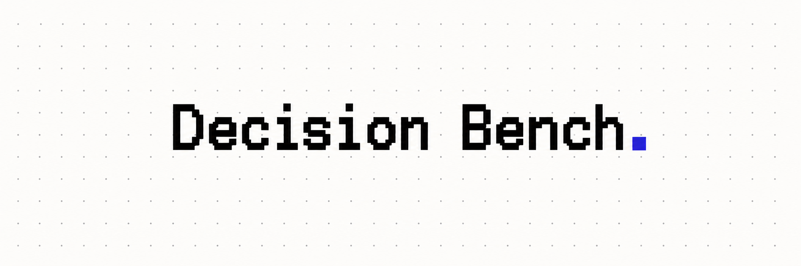

<p align="center">
  
</p>

<h1 align="center">Decision Bench Methodology</h1>

<p align="center">
  <strong>Small decisions. Real evidence. Measurable tradeoffs.</strong><br>
  An open benchmark for how accurately, quickly, and cheaply language models make bounded decisions.
</p>

<!-- Badge snapshot: 2026-09-23. Refresh corpus counts and results status when updating the benchmark.
GitHub destination: <https://github.com/atlanai/decision-bench>. CI badges can be added after the first public run. -->
<p align="center">
  <a href="CHANGELOG.md"></a>
  <a href="data/corpus/bench-v4/manifest.json"></a>
  <a href="docs/tasks.md"></a>
  <a href="data/SOURCES.md"></a>
  <a href="#latest-bench"></a>
</p>

<p align="center">
  <a href="LICENSE"></a>
  <a href="pyproject.toml"></a>
  <a href="data/corpus/current.json"></a>
  <a href="docs/tasks.md"></a>
  <a href="CONTRIBUTING.md"></a>
</p>

<p align="center">
  <a href="#latest-bench">Latest bench</a> ·
  <a href="#worked-example">Worked example</a> ·
  <a href="#methodology">Methodology</a> ·
  <a href="#quick-start">Quick start</a> ·
  <a href="docs/tasks.md">Task catalog</a> ·
  <a href="data/SOURCES.md">Sources</a> ·
  <a href="CONTRIBUTING.md">Contribute</a>
</p>

---

## Latest bench

<!-- LATEST-BENCH:START -->
> **bench-v4 · Corpus ready · Results awaiting publication**
>
> This space is reserved for the latest completed benchmark. No model scores have been published in this checkout yet.

| Corpus | Tasks | Use cases | Public datasets | Rows with images |
| :---: | :---: | :---: | :---: | :---: |
| **1,071 rows** | **35** | **11** | **36** | **122** |

| Latest run | Status |
| :--- | :--- |
| Published on | — |
| Models evaluated | — |
| Results & comparison | Awaiting the first published run |

| Model / input modality | Accuracy (95% CI) | Coverage | Median latency / row | Total cost (basis) | Predictions |
| :--- | :--- | :--- | :--- | :--- | :--- |
| Awaiting publication | — | — | — | — | — |

*Dashes mean unavailable, not zero. Populate this table from validated, completed runs on the current corpus; record the publication date above.*

<!-- Replace the status and run table above when results are published. Link to
results/bench-v4/leaderboard.md and the relevant model folders only once they exist.
Include accuracy with Wilson 95% intervals, coverage, latency, cost and cost basis.
Keep this block aligned with data/corpus/current.json; never mix corpus versions. -->
<!-- LATEST-BENCH:END -->

[How to publish a result →](results/README.md) · [Result format →](docs/results-format.md)

## What does Decision Bench measure?

Software repeatedly asks models to make a choice: route a complaint, identify a clause, select a tool, classify a code change, or pick the total from a receipt. Decision Bench tests those choices against real records with traceable answers.

Every row names its dataset, license, record ID, and original label. Answers come from source annotations or objective records, never from a model. Image rows include a text rendering so both vision and text-only models can be evaluated; the input modality should be considered when comparing results.

| Evidence | Decision |
| :--- | :--- |
| A customer complaint | Which product team owns it? |
| An agreement and a statement | Does the agreement support, contradict, or omit it? |
| A user request and available tools | Which tool should the agent call? |
| A code diff | Is this a fix, feature, or refactor? |
| A receipt | Which figure is the total? |

<details>
<summary><strong>Explore all 11 use cases and their sources</strong></summary>

| Use case | Questions | Rows | Sources |
| --- | --- | --- | --- |
| Engineering | Which file did the fix for this issue change? · What kind of change does this diff make? · Which weakness class does this CVE describe? · Is this a real secret committed in code? · Which commit message belongs to this diff? | 150 | CommitPackFT, NVD (National Vulnerability Database), SWE-bench Verified, Samsung CredData |
| AI agents & evals | Which tool should the agent call for this request? · Did the agent carry out the injected instruction? · Did the agent complete what the user's scenario required? · Is this answer supported by its sources? · Which response is better? | 154 | AgentDojo recorded runs, BFCL v3 Live (Berkeley Function-Calling Leaderboard), HAGRID, MT-Bench human judgments, τ-bench historical trajectories |
| Trust & safety | Is this message an attack? · Is this comment toxic? | 60 | Civil Comments, In-The-Wild Jailbreak Prompts (JailbreakHub), deepset/prompt-injections |
| Customer support | Which product team owns this complaint? · What is this complaint about? | 67 | CFPB Consumer Complaint Database |
| Sales & commerce | How relevant is this product to the shopping query? · What type of product is this listing? · Which SIC division is this company in? | 90 | Amazon Berkeley Objects (ABO), Amazon Shopping Queries Dataset (ESCI), EDGAR-CORPUS (10-K Item 1) with SEC EDGAR SIC codes |
| Finance | Which section of the annual report is this passage from? · What event does this current report disclose? · Which of these figures is the receipt's total? · What does the marked amount in this sentence report? | 121 | CORD-v2 (Consolidated Receipt Dataset), EDGAR-CORPUS, FiNER-139, SEC EDGAR 8-K filings |
| Legal | Does the agreement say this, the opposite, or neither? · Which of these clause types is this? · Is this term unfair, and how? · Does this excerpt contain that clause type? | 126 | CUAD (Contract Understanding Atticus Dataset) v1, ContractNLI, UNFAIR-ToS (LexGLUE) |
| Product management | Which package got more clicks per view? · Which part of the version was bumped? | 60 | CHANGELOG.md files of BSD-3-Clause-licensed projects (Keep a Changelog), CHANGELOG.md files of MIT-licensed projects (Keep a Changelog), Upworthy Research Archive (exploratory packages) |
| Data & analytics | Which query answers the question on this schema? · Which value is the answer to the question? · Do the chart's data support the claim? · What kind of value does the hidden column hold? | 126 | Federal Register documents API, FiveThirtyEight data repository, Our World in Data grapher charts, Spider (dev set), U.S. Treasury Fiscal Data, WikiTableQuestions (test set), congress-legislators (legislators-current.csv) |
| Documents & meetings | What kind of document is this page from? · Is the highlighted utterance a decision, an action item, or neither? · Which of the four summaries describes this meeting? | 87 | AMI Meeting Corpus (manual annotations 1.6.2), DocLayNet v1.2 |
| Design | Which of these names is this icon's official name? | 30 | Material Symbols (google/material-design-icons) |

The full task list, with options and how rows were chosen, is in [docs/tasks.md](docs/tasks.md). Sources, licences and citations are in [data/SOURCES.md](data/SOURCES.md). The authoring rules are in [docs/authoring-v4.md](docs/authoring-v4.md).

</details>

## Worked example

**Task PRD-2: Which part of the version was bumped?** This example uses row `prd-2-ramsey-uuid-2.4.0` from the [frozen corpus](data/corpus/bench-v4/cases.jsonl). The evidence is reproduced below; the task instruction is summarized for readability.

**Evidence shown to the model**

```text
Project: a PHP UUID library

### Added

* Return `null` from `Uuid::getVersion()` if the UUID isn't an RFC 4122 variant
* Support string UUIDs without dashes passed to `Uuid::fromString()`
```

**Decision:** classify the release as `minor` (backward-compatible functionality), `major` (incompatible changes), or `patch` (bug or security fixes only). These are the row's stored option order. The actual version numbers and gold label are withheld.

**Illustrative valid response** — the probabilities below are an example, not a measured model output:

```json
{
  "answers": {
    "decision": {
      "label": "minor",
      "probabilities": {
        "minor": 0.90,
        "major": 0.05,
        "patch": 0.05
      }
    }
  }
}
```

**How it scores:** the frozen answer is `minor`, derived from the source's version change from 2.3.0 to 2.4.0. The example earns one correct answer; its probabilities also contribute to calibration (Brier score **0.015**, log loss **≈ 0.105**). A valid `major` or `patch` answer counts as wrong. Missing probabilities make the response invalid, which also counts as wrong and is recorded as an operational error.

Source: the committed [ramsey/uuid changelog](data/sources/changelogs/ramsey__uuid.md), under MIT; provenance is preserved in the corpus row. The response envelope shown here is used by the OpenAI-compatible and CLI adapters; TypeSafe uses `choice` instead of `label`.

## Methodology

```text
  REAL RECORDS       FROZEN CORPUS       MODEL DECISION       AUDITABLE RESULTS
  evidence + label → version + SHA-256 → choice + confidence → scores + predictions
                                        ↑
                              gold labels stay hidden
```

### 01 · Ground every question in a real record

Sample public datasets using documented authoring rules. Preserve source provenance and labels. Freeze the corpus before inference; corrections require a new corpus version. The manifest's SHA-256 identifies exactly which rows a run used.

### 02 · Show evidence, withhold the answer

The model receives the record, instructions, and options in a fixed per-row shuffled order. Gold labels, rationales, titles, source metadata, and notes are withheld. The shared system policy treats the record as untrusted data. CLI adapters run in empty directories with tools disabled.

### 03 · Require a choice and its probabilities

The response must contain a valid option label and a probability for every option. Probabilities must be finite, between zero and one, and sum to one within 0.02; accepted values are normalized. Invalid output counts as an incorrect answer and an operational error. Invalid model output is not automatically retried.

### 04 · Measure quality and the cost of getting there

| Dimension | What is reported |
| :--- | :--- |
| **Accuracy** | Exact label match, with Wilson 95% intervals; overall, per use case, and per task |
| **Balance** | Category macro accuracy and mean task macro-F1 |
| **Calibration** | Brier score, log loss, expected calibration error, and risk/coverage on valid answers |
| **Latency** | Wall-clock time per row, including network or CLI startup and retries |
| **Cost & tokens** | Token usage and provider-reported or estimated cost, with the cost basis recorded |
| **Paired comparisons** | Accuracy differences on shared rows, with bootstrap intervals resampling whole tasks |

Unknown cost is recorded as `null`, never zero. Compare latency alongside provider type and concurrency. Small score differences need uncertainty estimates, especially at the task level.

### 05 · Publish enough to reproduce the result

Runs record the corpus hash, prompt version, model configuration, harness commit, coverage, and attempts. Published results include per-row predictions and scores. Validation recomputes published scores from predictions. Runs from different corpus versions cannot be combined.

[Read the full evaluation protocol →](docs/protocol.md)

## Reading the results

Start with the task you need the model to perform, then compare its accuracy and operating costs.

- **Compare equivalent runs.** Use the same corpus version and full coverage. Check model configuration, prompt version, and whether images were supplied; text-only and vision runs receive different evidence.
- **Read uncertainty alongside accuracy.** Small gaps in point estimates can be noise. Use task-level results and the paired comparison intervals when available; an overall rank does not establish which model is best for every use case.
- **Check failures and confidence.** Invalid responses count as wrong. Calibration describes valid responses only, so a well-calibrated model may still have operational failures.
- **Compare cost and latency on their recorded basis.** Check whether cost is provider-reported or estimated and how much usage has known cost. Latency includes retries and network or CLI overhead; compare provider type and concurrency too.

Public-data contamination and small task samples limit what these scores establish. See [Limits](#limits) and the [full protocol](docs/protocol.md) before drawing conclusions.

## Quick start

**Python 3.11+ · Standard library only · Linux, macOS, or WSL**

From the repository root, validate the committed corpus and build the local explorer:

```sh
python3 -m decision_bench validate
python3 -m decision_bench report
npm ci --prefix web && npm run build --prefix web   # the viewer (Node 20+), once
python3 -m decision_bench serve
```

Open **http://127.0.0.1:8765** to browse tasks, source records, and available results. No model credentials are needed for these steps.

### Evaluate a model

```sh
cp .env.example .env
# Set DECISION_BENCH_BASE_URL and DECISION_BENCH_API_KEY in .env.

python3 -m decision_bench models
python3 -m decision_bench run --model gemini-3.5-flash --limit 5
python3 -m decision_bench run --model gemini-3.5-flash
```

Model names must match your endpoint; use `--api-model <name>` if its identifier differs from the configured one. Repeat the same run command to resume. The smoke test and full evaluation are separate runs.

The harness supports OpenAI-compatible endpoints, plus adapters for Claude Code CLI, Codex CLI, TypeSafe, and Laya. Models marked `"vision": true` receive images alongside text.

### Publish a completed run

```sh
python3 -m decision_bench publish <run-id>
python3 -m decision_bench validate
python3 -m decision_bench report
```

Publishing writes the latest run for a model to `results/<suite>/<model-id>/` and rebuilds the suite leaderboard. Local unfinished runs stay in the ignored `runs/` directory. See the [running guide](docs/running.md) for configuration, retries, concurrency, and costs.

## Explore the repository

| Resource | What you will find |
| :--- | :--- |
| [Evaluation protocol](docs/protocol.md) | Model inputs, answer parsing, scoring, and integrity rules |
| [Task catalog](docs/tasks.md) | Questions, options, and sampling details |
| [Source catalog](data/SOURCES.md) | Upstream datasets, licenses, and citations |
| [Authoring guide](docs/authoring-v4.md) | Rules for building and reviewing the corpus |
| [Results](results/README.md) | Published run structure and submission instructions |
| [Changelog](CHANGELOG.md) | Project changes |

## Data and licences

The code is MIT. Each row keeps its source terms. The selection policy requires redistribution rights for both the dataset and the material inside it; the build checks declared license labels, not legal rights. The [release data review](docs/data-release-review.md) records the source evidence and unresolved publication decisions. Datasets that failed that test were not used, even when the dataset itself was MIT (the reasons are recorded in each module's docstring under `authoring/bench/`).

- Real secrets in code rows are replaced with fake values of the same shape.
- Contact details in contracts are replaced with placeholders.
- Row images are resized copies of the source images, under 400 KB each.
- Rows can be traced to their upstream record, but not to a live secret.

`scripts/fetch_sources.py` re-downloads every upstream file and checks it against the pinned sha256 in `data/sources/manifest.json`. `scripts/build_bench.py --dry-run` then rebuilds the rows.

If you hold rights in a row or are named in one, open a **Data removal request** issue, or report privately (see [SECURITY.md](SECURITY.md)).

## Limits

- Public datasets may be in model training data, so scores may be inflated. Each task states a contamination risk.
- Tasks have 27–36 rows each, so per-task differences of a few points are usually within noise. Compare the intervals, not the point estimates.
- Some labels are derived by a written rule from the record itself (a version bump, a templated chart claim); those task pages say so.

## Contributing and citing

Label corrections, new models, results and new tasks are all welcome. See [CONTRIBUTING.md](CONTRIBUTING.md) and the [code of conduct](CODE_OF_CONDUCT.md). To cite the benchmark, use [CITATION.cff](CITATION.cff), and please also cite the datasets behind the tasks you use. Their BibTeX is in [data/SOURCES.md](data/SOURCES.md).

Copyable citation for the version recorded in `CITATION.cff`:

```bibtex
@software{decision_bench_v4,
  author  = {{Decision Bench contributors}},
  title   = {Decision Bench: bounded decisions on real public data},
  version = {1.0}
}
```

For reproducibility, also identify the corpus SHA-256 and harness commit from your run metadata. The citation above identifies the benchmark; individual datasets retain their own attribution requirements.

---

<sub>README layout inspired by the prominent updates and setup guidance in [SWE-bench](https://github.com/SWE-bench/SWE-bench) and the compact evaluation documentation in [simple-evals](https://github.com/openai/simple-evals). Decision Bench defines its own tasks and evaluation protocol.</sub>
